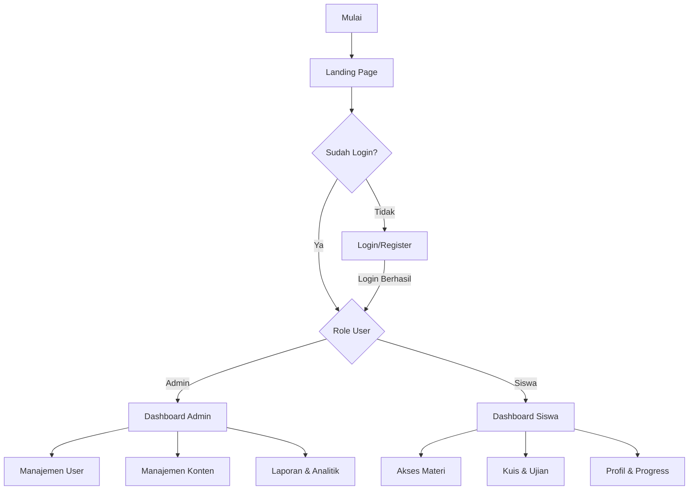
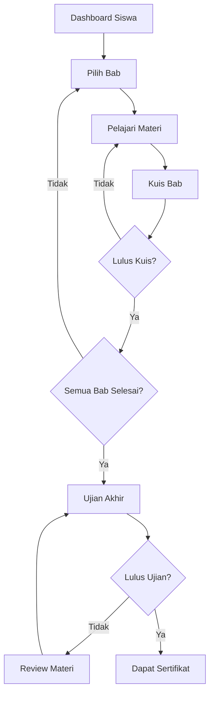
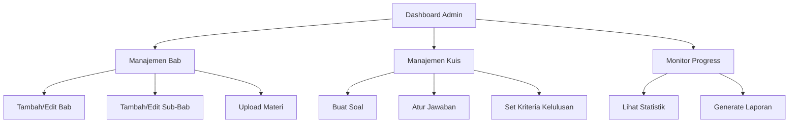
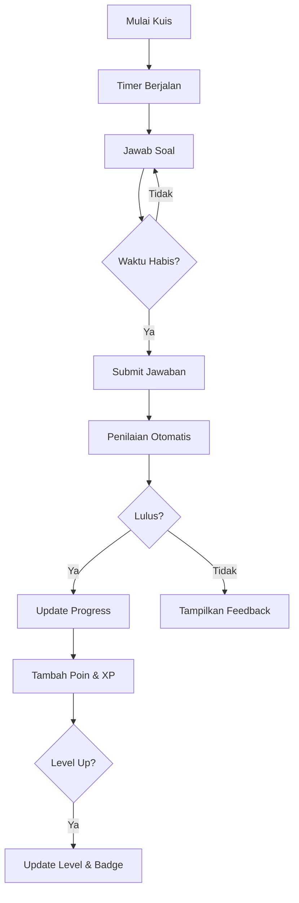
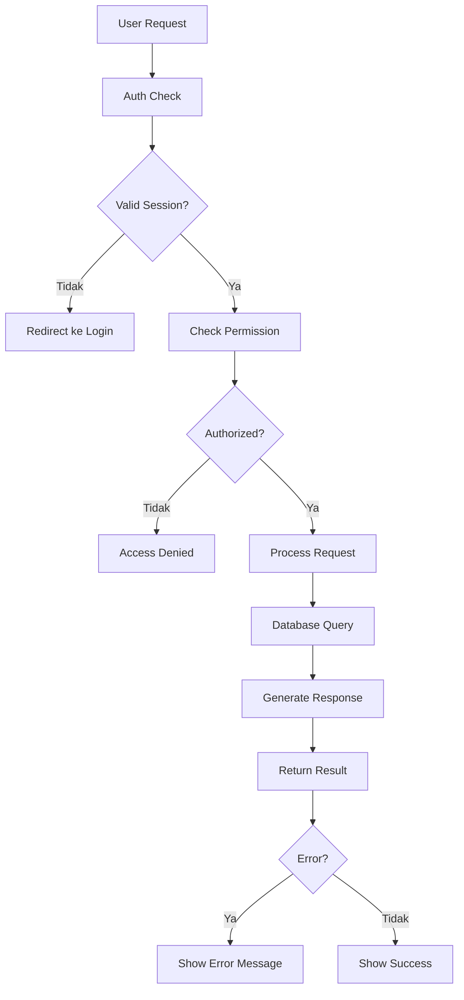
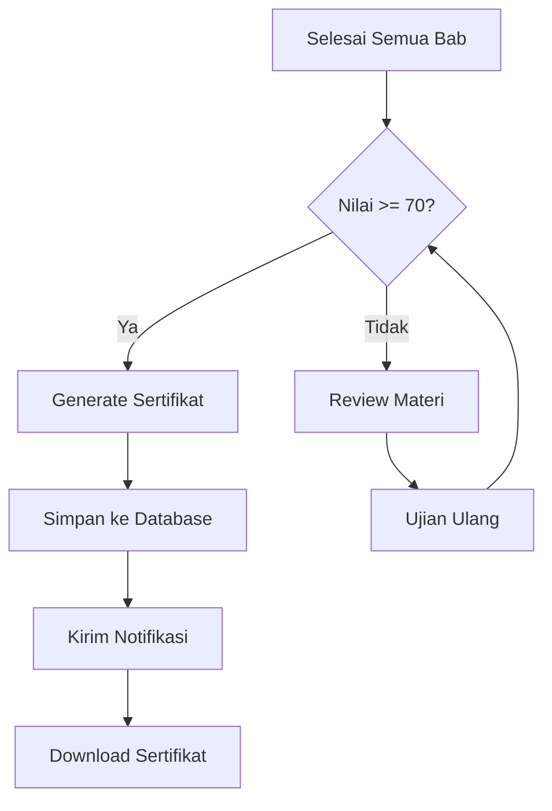
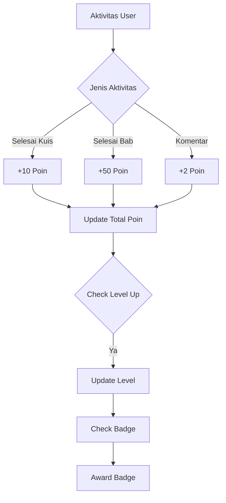

# Diagram Alur Sistem Pembelajaran Desain Grafis Interaktif

## 1. Alur Utama Sistem

## 2. Alur Pembelajaran Siswa

## 3. Alur Manajemen Konten Admin

## 4. Alur Sistem Penilaian

## 5. Alur Interaksi Sistem

## 6. Alur Sertifikasi

## 7. Alur Gamifikasi

Catatan: Diagram-diagram ini menggambarkan alur utama sistem. Setiap alur dapat memiliki sub-proses dan penanganan error yang lebih detail dalam implementasinya.
